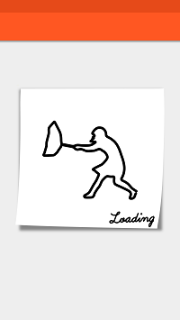

# MovieWatch

#### 自定义缓冲条
        之前在泡在网上的日子看到一个特别合口味的缓冲条，可是无论怎么样添加依赖都是报错没办法只好重新把它，做一个依赖。
        然后新的调用地址
        
        //项目根目录下添加
        
        allprojects {
        		repositories {
        			...
        			maven { url 'https://jitpack.io' }
        		}
        	}
        	
        	//app目录下添加
        	
        	dependencies {
            	        implementation 'com.github.115MRLI:MovieWatch:1.0.0'
            	}
        	
### 展示图
  
                       
                       | NINJA                               | BUTTERFLY                          | VIOLIN                              |
                       |:------------------------------------|:-----------------------------------|:-----------------------------------|
                       | |||
                       
                       | RIFLE                               | HEAR STYLE                         | TOOTH                              |
                       |:------------------------------------|:-----------------------------------|:-----------------------------------|
                       | |||
                       
                       | CUCUMBER                            | STORM                              | DOGEZA                             |
                       |:------------------------------------|:-----------------------------------|:-----------------------------------|
                       | |||
                       
                       | CAT                                 |
                       |:------------------------------------|
                       | |)